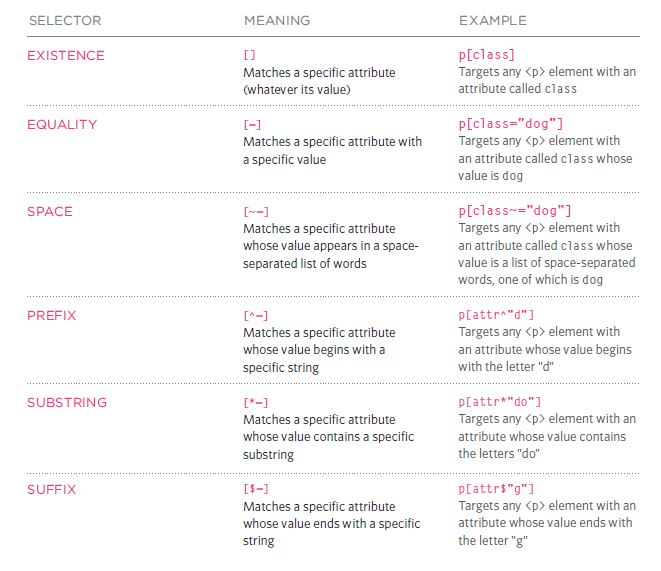

# HTML Images; CSS Color & Text
## HTML Images
We insert an image in HTML using the img element :
``
1. **src** is the picture source it might be:
* external URL 

Here you will link the picture from external website to show it on your website.
it's a bad practice to have the picture from other websites because some websites have copy rights on their pictures moreover the website might delete the picture and you will lose it on your website.

* Internal path

Here we will put the picture path, where it is located in your machine.

2. **alt** it is the alternative text that will be shown if the pic is not showing on the website.

There are thousands of pictures types however 95% of the pictures are in Jpg , png and Gif format.

* **Jpg** pictures are best used for photographs and paintings of natural scenes where the variations in colour and intensity are smooth.

![](data:image/jpeg;base64,/9j/4AAQSkZJRgABAQAAAQABAAD/2wCEAAkGBxISEhUSEhIVFhUVGBcWFhYWFxcVFRcWFxgWFxUWGBYYHSggGBolHRUWITEhJikrLi4uFx8zODMtNygtLisBCgoKDg0OGxAQGy0lICUtLy0vLS0rLS0tLS0wLy0uLS0tLy0rLzAtLS0tLS0tLS0vLS8tLS0tLS0tLS0tLS0tLf/AABEIALcBEwMBIgACEQEDEQH/xAAbAAABBQEBAAAAAAAAAAAAAAAAAQMEBQYCB//EAEYQAAEDAgQCCAMFBQYDCQAAAAEAAhEDIQQSMUEFUQYTIjJhcYGRobHBIzNCUtEUFXLh8AdDYoKS8TSiwhYkU1Rjk6Oy0v/EABoBAAMBAQEBAAAAAAAAAAAAAAABAgMEBQb/xAAvEQACAgEBBgUDBAMBAAAAAAAAAQIRAyEEEhMxQVGBkaGx0SIyYRRCccFS4fAz/9oADAMBAAIRAxEAPwDw1CEIA9W/srdRfhnU3ls5z2TGhA2UnpF/Z1Rqy+gerd4d0+n6LH9Aa9NjnOqCWg8pi2q1PDukdZjndqacnIHzpOmba3NbJ2lYHnvGujuIwp+1Ycv5xdvvt6qqXvVHjmGr/Z1Ia4i7XQQZ5HQrPdIP7O6NWX4c9W43gXYfTb0UOHYDyZCs+McAxGFMVaZA2cLtPrt6qsUAIhKnaFAu0j3SboaTbpDKVThw525HzTjOHN3cfSyniRNVgmVsIhXLOH0/E+Z/RPMpUgYDAT5T8VDzIr9OygDZUingKrtKbvYge5WmpVANLKSzEBQ876IrgIzNPgdY/hA8yPopFPo8/Vz2+QkrQnENGphcvrDYgyp40mJ4UYqvTLXEHZcK34/QuHjex+hVOumEt5WYNU6FSIQqJBCEIAEIQgAQhCABCEIAEIQgAQhCABCEIAEIQgDU9CKzWF7nNzAbeMLTcLr9t14Y6YblzieRCzHQasWPcQJiJETa82V/hMS0Ygw0nMez2shaTvK2WkN6xX9VHHFBhzIaMr7XaewRvY3B8EvD+MYjD9x+Zv5XXH8lI4lixpUoEsPdeQA7/ULOUCpRpETSqEf4Xa/zTq+QzaYXjlKsz7ZgDSILu/TneTq31Co+Of2fUKw6zDODCbgDtUz6beiyzKjmjskiQQYJEjkVNw/Fa9B8sc5k3gjsnzbop6ajMxxjgOIwpirTIGzhdh9f1Vc0xcL13BdL6VQZMTTAmxcBmafNuo+Kg8V6C4bEN63CVAwnYHNTPpq3+rKXHsB53Rx5GqePEByRxjgWIwxirTIGzhdh/wA36qsWLxo1WeaVFgeI+C5PEjsAmcPQa78UHlF1IGEaOZ9VDUEaR4slaGzxJ/glGPqnQ+wCdbTaNAEpKPp7FcOfWQ2K1c/icPWPkjqnnvVT7kpcyQlAcNdQdh2bkk+KgkQphTFdu6qLM8uNVaGUIQtDnBCEIAEIQgAQhCABCEIAEIQgAQhCABCEIAEIQgDVdAcWaVVzg3NYWFzF1osP1NWs5zmua7NIAbnbewBbqbrN9AMQ9lZzmNzkAdnnqr+nif8AvRqObl7QcQHZXCDo3mVp+wLrUsK+KZTBptcTbVvaYTyLHd3yCqcRRp5S4gTzYcp9WH6J7iuMyvuwua4ucOsAzQTaHN1VZWxcnstgciZ+KpNNARdh6q34ZiW1B1VTMSZykw4DYCDBnyKpibD1Uvh2GbUJbmh94GVxHn2QSlYUS+I8JDIgwTtf5EZh8fNQaGJqUXSxxa7m0/Pn6q2dxJ1MFlSm0iNWQW+EsdIHpBUeriadRsdmBJuIIjYSZ9A46KeSpoqrd6Fpgul2YZMTTD2mxc0CfVhsfRRsd0QwmKBqYOoGO1Lfw+rDdvyVDXpAXDgQTaDf1BummVXNIc0kEaEGCPIhMRW8W4HXwxiqwgbPF2H1GijU8URZ1/Fb3hvSZxaWVwKjdy4QYMC5FjruPVRsV0cwmK7WFf1VQ36t2h/y/wD5JCiUEyozceRjzWbzXBxA5qRxbgdfDn7VhA2eO0w+u3qoLKY3n6HyKzcEjZZpS0VHZrhc9f4JcoGy6kJaFfX1Zx1h5IMnklJSZwmL+WMuEJF28yuFaOaSpghCECBCEIAEIQgAQhCABCEIAEIQgAQhCABCEIA0fQrFGlVc4CYAt6q34hiy6t1kATsRIG2m6oOi/ff5D5q/qYTPfMAeS2gm0IuK1OjVaHmnTuCR1b8hAbbuutNlmWESeV4m/lputZwzDPFNk5iMp1Y2q3U6AXAVLxzCgODm5eRaxrmweZadFMY6WNt9SmJsPVSKdZrLtJLrEHQQR2gRrPiox0HmVccNbSqjK9rQ4WENdJtuWGZ9FaVkydczl3FmvbFQOLr3JDxEePaHuqiVeVeBtPcf4QHNJka9l2Vw9lWVsC5ri0xI2Jyn2cpX1aIbShrZGlIU7VoOb3mkb3HNNwigscw8w+Py+GkhJhxZ1iYgiP0/lsu8KO9/C5d4JmogmwsJvzIA1I2QkK0TMJ0iqsEFwqs3ZU1jkHX+vkm62AwWJvSd+z1D+B0dW4/L2jyVbUomSDM+Nj6hcGiUULeI3FeCVqH3jSB+YS6mfXVvqqtzSNVqMFjq9KzXS38ju03229IVd0gyHK9tLqyZzAHsk7EDbdQ40Vv2UyVWGF4LWqNDmgQdCSFKb0Zrc2D1P6JbrJeWC6lLKRaFvRV+9QegJT9PomN6p9Gx9VW5Ih58fcy6Fr2dE6e73/8AKPopFPotRGzz5u/QJ8ORL2mBiELfM6NYcf3fu536qRT4FRH90z1E/NPhMl7VHszzlC9QpcJpjSmweTQPopNPBgaADyCfB/JL2tdjyxmFqHRjj5NJTzOFVzpRqf6SPmvU24dODDJ8FdyHtcux5e3gGJP90fUtHzKfp9GMSdWtHm4fSV6V+ypDhk+FEX6qfZHnQ6KV93Ux6u/RReLcGdQa1znA5jFgeUr0p1BZfp3TilT/AI/+kqZQSRWPPOUkmYlCELE7gQlSIAuujHfd/D9Vb43UKm6Mn7Q/wq6x2o8lrHkIveDvHVtl1MWNy59N05rdoWJVPjMXVbUcHPDjOs5h77q84Dn6tkdaRDu6aZHe/K7QKBxPiVVlQtfTYRtnptDo52Rjb3fF+7HIz5Mj1KteF46nRkPGbNBs1jgLaEOEz5FVJNvUq44VRFYR1AIbEuGedNTlKaSZDlRYM4lhjF4MzcPaOWnbb8FB4riWF05aT2nQiz7cywN+SfdwRsgFrm2u452jy7TNfBQ8dw6nTE9Z4QMrvKYMj2UXT1La3lz/AKI4dSIuKjfIhw32IHzUcBdmk3ao3yIcD8k0Hq2ZIcDVN4fTGa+kHUwNt1AD1OwL5J8hpANt5OkJxeonG1Q7jQCQAZHwB8tk23DINNzTpN9iD8k4yqBqlKWoow0ODQVT0kpxTaf8X0ctFTqMOpVV0tazqWlpnti3o5S5aDUNbLfolhC/C0yBPe+D3K2OCg3Ca6Bih+xUzUeWkF82OXvu3iPitG/G4OmC0guIE90yZvA0+guE4zVGM8DcmyDheH0Il7o8NT7p2vgcN+AuB8ifmojOO0DctDQC4Bs5jO2Yhs+mnnuuK41Tt1dNmd1y4NN9hmmARoJuABPgjed9SuGq6eQy8MbN9J2O2uyj/vDDj8Y9A4/RVlWnmJrOcztGbXBk2gbpvF1GgDMW7AZRfWPb9E+IR+nRb/vahzJ8mn6rh3GqI0a8+gH1VZg8IahsCBY5iDEEf7qRT4aHOs9sN1JLQD8ZgIeQFs+pIp8dbvTdM7EaRbXeU8OkNMH/AIckXsakE8pIbaPBVXEGlsNpiWzLniPQSNrbnkqsPq0jlc3MBrYmPDMpUm+dmrxJckvI19Hjmd7AymKbTZzAcxkmxc5w7Qs0ZdO0dVUt4xUpOLjL2FxD2kiGOIDoDo8TbSNgnuBGlUdEHM4ACbBrpzXjXu2gjRXfG8JT+7Y2Yk1iP8WUxprABJASSalaKai4UyDR6Q0zq1wHOx+qtcFVZW+7cHEXImHDzabqm/7K020n1BWe0AWBAcHchaCBzJJ1VY3C5XQQ4ONw5s/h1EjSRK03mYcGJsX4I/7kBY3+0fDltBh/9QD/AJXfon3cZqUzHWOJ2a8yCBrcmR/Wqrum/GW18MxokOFRri0kGOy8ajzUuTLhiipJmFQhCyOoUpEqRA2W3Ro/an+Eq7x+oVH0cP2v+U/RXmP1C1jyIZdcEy9W2er/AB96m87j8Q1PyVXx1wNUwAAABbNB8e1dXHAC7qmxn/GLVWs3GjToqTH1HVqxGY65QXuFgObhbmpxtU1+X7sqSZAy9iZHeiN9NVK4XjerdBALTGaWtc6AD3c2ihHQ/wAX9eCSlr/XIqmI2TcaxzZbLROgDWm45NqC+iq8VXw9QnM5xdoXOa6Rrp9oZTPD8a2iHB7iCYcAC+8tEHs2S4niVI0y3PmkRHbF/Wy13IpaP2MXKW9TTK7FU2g9gyPIj1v/AFZMEHkmpSSsTah3MpfDHjOJjQ6iduSryU9hmNcQ1xIBtI+GxTTp2JxtUWHEnkXeD4EOA8+yWqA6uNs0+MJ3F8PDZyOmObh9QP6Cry0pN6gloTaVVM8baeqmLSPqo0kJjGV3FuUzEqWNI03QrDuezstLoLuy03JtqNhzP6q9x56ukQaUwcxyuklx16yY57TGyyXAuJ9VhnNayXF5glzhHZEHkY5eK4w9Z3bLs2Zw70yCdJnmnGyZKPiWrJeA8AW02I53tJ8PgncPxHq3ZXiwNnmQW+h28JhVODpFxgktB8NQNZ908abs3YaMxkFoBLCdiBsrM6JPGMQ1zyREkjQm0gbcrSPNQqOIDTB9CD+i6bgDfMch3aQQRrz2i6n/ALLSAAhpOnd8BoZuNT/mPgockaLHJ9BMPxYN73VPkz2xUJGkA5RBFviVI/fTWhuUUADeMlQgjS4jct+agvytdAZM6AabnYT78l2yoRlGUnzfBHadDYGu3wVLUTTWg67GOJGZzS0doBmgO1jflsnhUbkMuuRLuZ1IEeJv6Jqs4NE/aZrSGmGixsZBnX4DklFfNbK8mdSGkQAYsRaQdVG/EvhSLLo3Xp0y9xBkNgASbgm4kjSf0V/w3C0xnMwIgyMoAmZ8llOHPqBzjSYSS0uIc8NgTfXfw5KaK9ZwyOpWdl/EGnXsgG03VxnFrmZyxyTqjUV6lJwD3GKbO6OZAN41lZ4YtrS57eyzNDWOs6bWHvYbLoYYgtz0qhi0Cq2O1e7dibWtMDVLiMI8s+zbAEyXlrnRbQtIa2SRJEmI8kuJDuvMODP/ABfkccUFCs0l7YcBM6GB3rjWLGDssb0m4X1TGua6WZrcxIJAJ30WtZhnHvFgIiSXNsIsZB08QqLpXg3NoFwc1zA5sQZiZIA8L2SeSD6occU10fkYtCEKDQUpF0VygbLPo7996H6K+x+yoOj/AN8PIrQ4xslo52WsORLLjo+2abbDvP8A7g1OX4lD6StdmaS2GxY9X1UncQrPh2DdSY0PLRMunrywQbCzd7LO8RquNRwL8wBMdouHoSlDl4v3HIgRY/xIo6j+til2PmEuGbLmiYkgTrrbRNgavhb2upsiCQADAYXaDWKTiPVdY5zYc1zZBFwARH/xNsqF2AxDDlByA7Zw3NFpIB1UN2DrOBcWVCBqSHfMqK10LVWOY6jSa4gEtIHdAzCYkdou8lXylKSE7ECeoAEjNpN9rJlO03xukCJ3FHZnCHlw5SCBFtAYHsFGa1IwhSKZCyk2axihmByUXih+zNhqNvFW9PLP8pTHHKH2Djyy/wD2H6rPf1Rbhow6FVLOYQ3JcmW5iXEANDdyZ2AV5QxohznU2SBJBY3S1hl0MXve5gWVT0HoNLHkgkmo2nADrhwM9oEZdDey1uP4bTpR1rslMauFNzgQNMxBgG9iZ02usMuasjibYcN41Ig4LHM7waIeBDoaBJBMZMpJMAGB4zCkvxtTLBIkuyDRtyTA7BJibAWmQDumOH8QwDnd8mSGgljgSdhM2cRv4Kxe1mbOHtZAJYXuax40jsjtWl1zzJg2Wc8k96mn4o1hjgo2mvBlDxVrMxqVDEmwb2yCLQTaIEhR8RVo5SWvtEQe/wDWLxrBj42Y4vhqT5LM4gB9RpNQyLRJfvc7nw5V/EeIYKoTlc83hrTTgAGSbDxjfddULdWmc02taaGqfGGNp5GB1+85waSTGg2i6jVuLPz5szr3MgG8zJ9bp/r8IDGY217I9lGx2JowzJEdoTlMm+/uumMUujOaTb6oMPRZUqDK8smJzA6kicpnmTuPotGzBU6czULgQZdYu0m0d756LK0qtMgwRm/KQYI8ORVvSx2GYQKdV73EAjM0Mptd+VxkEj3BFlllg+l+RrikuteZKxuFEFoEEnsy4MDiR2ZsdNbQeyuhg6rSx3WNaZAcKZdUkTEB2x1Nza9ipGG4bWxWRvXYfK5+aaeZztHCYuBqbayrml0Kp0gXCrWkiCAZBGwIY0GLaAhcWTNGOjl6HZDG5a0UWH4ZVfcVPs/yHPGa+ZrohzhcW8TquqnDnB8uqPdTHbyBjzdom7iNCSbXPjstVhMM0Ocy1hALXvJAAAd1j57PgB+VQsTTohkUSHgE3z1CAQJAaGkknTSYiVzcZt9To4aSMvV4c5zi5rgGuIcGkuN85l7RYGdRAJB+Fd0mwmTDOkHvMIcSXXMyAXA85iRqbLbUazC3N1BOafwnVpFywk6STJN55rK9PcBU6rrHvcS2xAYS0tLxll1g3WYvoBK0xZG8iT7meWCWNtdjz1CVIvWPIOyuE4U2khyLHgH3w8itFjhos5wL75vr8lpccLBbQ5EMt+B4kOaGAgPAJAbTaTA1OZ1tBKhYrg9VznPeWNzGZe9oN/AJrgMdcJy913eBI0OwV1VbVyg0GtzGLijkHj23rZpbqZKb3n4GQe2Mwkd7Y2MbjmuqFAktJDspIEgeOx0lS29eHva2JntHs6/xJh9LZ9YW2Eu/ksnQnmgnV6+fsTG4muyGCqKbZyi7QQObi0EnzUHiWIdmINY1ebpdB8IMJaT6DTdj6ltC7IJ9Lrp/E4EU6NJniG5nf6nyonalSXjpRs9CuJXJKcq1HOMuJJTZVNdiU3WoiUFcFPUsK91w23M2HuURhKTqKsUpqKtuga5SaNQKM80md5+c8maf6jZRqnFiLU2hniLu/wBRTlhivvdfxq/j1Eszf2rz0Xz6GlosESQGjm63tufRQuOhnUuDahJMW0Go21+SzhxVRxmST7n3XDnu3JWDjBcvU2U5tamm6D1HjrQ2t1YGUkZS5zhDpyiRBtr4rXU20esDsRis7CG5GvcGxY5i4iAeUeK8toYp9Ocji3NExvBDhPkQD5gJ9nFqwBAqETrpftZr8+0J81jPBGTbuvBe5pDO4pRq/E9Hx37rIMvaHGR2C548zYgH0hVGNpYV5Bo/Zhtpc489ZO5EWkLI/vivEdaYgjQaFweRpu4A+YQ7jFYjv65pMCTmu6bbwFePDGP7mTPM5ftRf/u+iTJxGbwAt7lSKfCqX/jBvkL+5WZPG69zn1k91u4g7cgPZWVHjGMqnrGta7JDiS0EANkiWkwdTst1/PoY33j6suG8IpaCsfYfoueI8LYKYh8weQ3kH4tCzhxOI/L8Aj9pxJtkJnYNJ+SWt8/Qq419pZjh7T+MT5D9UOw8HtwfGL+41UENxn/l6n/tP/RRHcUqixAtaCCr3idOxrMHiKjYNGuARcB1t5g3ykTcTuVcM43V7IrOcQAROWZE5hNyHHaQJ8F51+9qnJvt/NdN4xUGzfY/qsJ4cc+fsaxzyjy9z06hxZ1V0gte7JDaZqvpZT4iBHeiL6K5pYfqqYFGNRJIdlbuTmB1nmV4z++qnJvsf1TrekNYb+xeP+pcuTYoy+10johtjXNHs+GosAz5C3OdCZ5wSNBbks90/eP2OsMw/BAGv3jLrzml0hqt0tOsOcPkUmN446rTNN1Nl47XaL9Qbkm/yus4bDu5FLe5Fy21ODjXMqUIQvQPPHSE0nyEwkjSZP4J9831+S1GNFgstwX75nn9CtVjNAt4cjJj3R0fbi7hZ3dIB7p3NlaY3EtYwE9WXASGvqOqk20yiwUXgFCm4PLurzBpy5ySSbaMGqhcXNU5TUYGtuGANDQRzjVXvJquxKi95srcTiS6QQ0S7NYReIjy8FGhOP1S06LnWa0nySSbdIptJWxmFyVaM4WR944N8NSfBdjqWXDZ73afYSzURzvyW/6WS1yNR/nn5czme1wbqH1P8cvPkVlHCvf3Wk+O3unn4NjPvagH+Ft3J7EcaYxwz9oA3Y0wCMpsY8SN9ll31iVMpYcfJbz/ADovJfI48WfN0vxr6v4LmrxOmz7qmAfzP7TvQbKsxWPfU7zifPT2Fl1w3hdbEOy0qbnHc7DzcbBaTCdB3teP2iqxjQMz4NmsJIbLjHacQYFx2STyPHm239spV+F8I7MGwSl9UY+L+WZXC4apVcGU2ue46NaJK1NHojTpNnF1oeRIo0y3OP4nmQPQFXtXGUcOw0sFSyD8VV1i+NiTL48x5CFnMXxJ8EWHlLv0+S4Hmnk+3Rep6kNkxYlc/qfp/srOI1ADkY45RoIaB8GiT4qtKervJMkpkrpgqRx5JWzkpClK5K0RzyBCEiZAoU/BYwsDgGtcHAAh2YiBJ/CQq9XPAekD8IXGm2m7OACHhx0mIyuHNFtaouG63UnS8/gdp4So5wH7BJOgDMQJt/H6p7ifBq1Nnb4e6nP429a737TgPXkt70Z6Z4WpSzV+pp1CSMueqBAiDdx8VpMN0twVMEMxVEjWHVj7DOTGp9k8byP7kvAvMsK/823/ACq/tngraT29rIbTqyRbWQRG6aNiJtB3Ex5jdewcT/tLp06jmNZSqND2tDm1jBDmgl9qRGUGxvNtF5Vx3F9dXq1gwsFV7qgabxmMxMX1VzWhimQHxJv9AgFcoWY7O48EkJAU51aRS1OEi7yJMqLDdZyhdZUIFTH3NUVTXBQkommVciZwf75nn9Ctjj8LUGUFhl1wOYWR4HTzV2Ac/oV6TVLQR1lbPUjK1rBJK9DZtneSDldLuefn2lY5KNW+yKfD8Pq0nMqPaQJIgGH6H2U8vqQCGtp27zu08jzdomq3SFzesFNjWFlyX9p0xBCp+Lcfw8UC3NUqATWDichPKNNVq4YMLUpXK+3Iz4mfLajUa76smOo0Wgvg1O0Gl34A46SdAmOK8R6p1SmKjGljmtbluHA3ccx0hZitxeq5jqYOVjnZy0aTsoBM6rN7fNWoJJfj55lrY4PWbcn+X/XIuMbxchx6u/aDg4ySCBpfaVVVq7nklxJkk+p1K4AXWRcU570nJ9TrhjpJdlXgcLY9A+jdLEh1SqC7I7KGzDTYGTFyscrrgvHa9Cm+nSflDjJIAzTEWJ002XPnUnCoOmdWxyxxyp5FaPUMbxChg2BjQ0OIhlNokwNXZW7SsbxfiD6rusLXB0QCXN0H+ESPgNdlnf3tVEnNJOpIBcTzc43J8ymqnEnu1hcuPZXHU9LNt6npy/BNr4yqdY9I+qhVKvPN6/yTDsUVya/mumMK6HBPNfUVy4LUdYuC5aJGDkgckXTW2nl8TySOdKtENdWIEuW8b3n01XdIgHSddecW81wJGnkgNKAN/r+vJPN7F4aZtDhOkGfimto9U652g5D5n/ZAE/B8bewQ2lSjxYT8ip7ekIPew1D/AEuH0KpGwV08eJ9ymtCXqOY7GNcczWsZm1awG3mTv5KC+qSkqNXCLELKRCEgBO0akWOiaQk1Y06domlq5LU1RqRbZPlZtUdMWpIbhC6hKmOh9zFWlaqlw0nZZiu2HOHIlRimnaDacbik2d4Krle10xBV1jekMOa6iMrm/i8VnkLqWSSi4rkcTgnJS6oexGKe8lznEkmT4plS8Dw6rWMU2E+O3utXwvoI83qu9B/V1z5M8Ifczrw7JlzfatO5mOGcIrYgxTbb8xs33WkxHR6lhKTHvHXVnua2nTM5XGbjKLkX+XNaHH8TwuDpdWHZqgEBjD2piBmI7ov5rB8Q4zWquFRzznAAaRbIB+SO6eZFyuaM8mZ3yj7nfPDg2aNP6pe3++x30hwVSi8Gs5hq1AXPYyPs9A1piwMbeCpi5DyZuVyuuEaWp5mXJvSdaeoJym5NrpqpkR5nZKRBKRItsQoBEeO3LxQkTIYLtrCbAaSTygXXLQdlIrdgZN9XnW/5fIfPyQ2XCFpt8v8AtBl75i1th81ykCUJkNthCWDoEN/qyGjfkgEhd7KwwWBbVdDqop2mXC07Cyr2aqdQO6TGNHD/AOIey5LYMTPwUqo8OMwB4BQazEJiaHBQc4w0EnwBPyCjuplI4k6pJTJOurPJJB5KVS0XRpqbZW6MDEGAI0Q+sDt77eS6dTKRviE7DdGXHknqT13kHJJk8FLdjjaZ2hNISo14h6jTwgCxvGei9UVHOYWlpJNzBQheTiyyhLQ+i2jZoZYVIiYPovXqH8IHMn6BaFvRbD4amauIcXButp9A0fVCFrLaMk5qN0r6GENiw4sbmlbSvUe4Ti8XX/4OjSpUh+OoQ4+w+ULO8f6Q4h73U/2hzmgx2B1TSRrYXjzQhbYIxeWSpaHLtk5xwQak/q56+lIoWldkoQu08tPQbcuUIVGb5glCEIEKkQhIoEIQmIdLOzmOpNh4bkpolCEkaZFTSXZeqsClKEJkdByo3LA5gG3jePaER2fO/wBP1QhJdDWaSlJLp8iU/r8v91LYLJEIZKQoSuCRCQho0wgUwhCAHGhdwhCCoqzlzUiEIKSOmBK6wQhIvdW6Ri1CEIMD/9k=)

* **PNG** pictures quality is higher than jpg pictures, this makes them unsuitable for storing or transferring high-resolution digital photographs but a great choice for images with text, logos and shapes with sharp edges.

![](data:image/png;base64,iVBORw0KGgoAAAANSUhEUgAAAS0AAACoCAMAAACCN0gDAAABIFBMVEU/Tk3///81OTmUpqbu8/Vxd3koLS2cnZ0wNDRhY2P1+vw5SUh2gYGZrKxER0c4PDyMS6EaICB9f3/p6uqMoJ9owYU9RkpOXVxqx4g8Tko1ltJKT09SV1g0mtmxvr9ZTWnnfyRanXM6TkhxTIQ/SkTugSE2TE5isn1Zq9+sebU6d5w+Vl5uWkaVZT3PYleGS5o8aoM5fql/TJNqTHxOe2JITldjTXRfVUiiaDtSTWFXZ2YoSk9VU0q/wMCPS6UNFhbTW0+DlJRLWlnS0tJ6qMOjjK9jqteogbLEcWmNp66Yn6icmKunk5Fvqc2gka2zhoJHZlhVj2utbDdcoXQ9YHKRkpK+eXKBqLxicnF7XUP4hRw5e6NDW1OKYUCwsbEABweui2gsAAAHmElEQVR4nO2daXvSShSAE5YwQAEjmIrE6sVaW6t1aa0rIkXv7nVp8fa6/v9/cROSQNZh0sziTM/7pTwUQ+b1zMyZM0mq6fmY1qp2Ww0G1do0Z+u1PB+uzEzTQCVVQIZpzhqsbNXGhugGUscwR2xs2abopjHBvMjCVlu9wPIwqvRtDdQZr+KYM9q2ZqpGlsuYdG4ktDUdB0dGyOiogYGC7oI6dG3VgwMb65OWKkzsoMOQToxktrpBaKFJq6wOrTVfF7Jp2qr5RzVUkdUqzxvSOvX7zLhC0ZbtHRSdSijr9fb29tv5q392dnbeuC9a7/Ze7b2bv+r4YUDWFcls+R3RENjos/J22+VX59WbHZffHEWfXu3t7b36vbUMLqNGz1bFz+IHidDqbVCApaw/tj3+Lf+54/FXuebKcnT97fx+4tsiS7mIbHU9W2g9bqvXbXhUGnEI3gneqDDs3699W2/n/dDljdMPPT65trwRGZEtfwrZ6k0rdDgXtjYalGx1e6xsreyJ/GxRclWpNDaY6cKP8vxs9brUbFUa7IYubAbBzVaPWj90YdcXU/GzU6a27HJvCVVZjq5WTwQMbV0MCaLrisUBib500TS2thQBbOUBbOWBpS09sZyRHXa2SoO1BBsbyfdkooqY2eo0E5TLR8k3ZaLEzpYWp1lurSfelAqwlQcetppN/+fC1qaPgAYXgoMtR9Kz4IVna/OqxxXZdPGw1UvauuIBtsBWMVuTiSdpaeuBD9iCUb6YrQDIIEhsHfmOlrYe+whocCGEZBDPP9+cc/25mEafGSFz4vOb1z3AFoktiK1sW2trR96LwNbWxyceW2IafWbEZBBbPgIaXAgxthb0iXAPEYKfnTg8euLpaawnLrlGRPP9QZj3PAVFEJJBLHl5gYCHzePLYT5YPA2FETInLiGR5dq6FEZtWxBbOWxpzwqOW0/P07jlaPJ/wJxIYIs0g1hWctLhZyULIbn8kv0Q1/ont3F84eklHcFzYniU3x/ev4pll6eYVH6iDMK1dQXDVfELpZ8ng3h5A2LL5cgbttJsPQox0LRdLPysZMElg/CBujzYom1rPbGLseBxiBf8Wn1WBI/yfsl5zkfxc94qBGcQwXaGA9iag7MFsZVn5fMkxH9gywWzqt4Kw6/VZ0WwrYxaw6oCjih49ETMLsb9NE76K6qDPAVFEDzKp64Hbw+xBeiX+8KiS7SttFrD7SG+Tq+2LUx2CrGVZxcjddzaXTFuPeLoJwqXVTXMiTlswVUjOWzBFUm5bMHVbsVswZWU2bbgKt0ctlJ2MV74CGhwIbhkED5QlyexhalBSAaPcStxV5S0CF5VSwbYyoPgGoRkwCifB8gg8iAmtoY+AhpcCC6jfDk2bg0v3POQTZeQOTGoJIMtsFXQ1qQXt3XvoQfYglG+mK0AyCDAFmVbuJXPZRJuWbuRzdlNK/OjB2xvLxO8qr58iQDXVnjjf9PK+qTqtkhjK25L3dhay64GHv+ymuMP1u6DEPc1K/OjjG9dFFyDsIiIXgGA+2dsZYmeE+W6kJLPNTbesJVm604ICfbLBGcQcAU43F3AyhbEVvKa5uy7C+6GuAO2XODugjy2AmBVTWILE1vDNPqrklZ+emJwGeXjuxhLgu2MCIeZq+bz8NQfwudBLDi0sKUJtZ/6A7Zy2Zr0MmsQwXZGhEPrFhalbcEon8tWAGQQYIuyLdJ7yL5sHmTVmi9ZZM/M8+4xiz0Q50T7mlnEznnPkOA5MVpvP8iaC29ZfWJZ8YctzW1lTa/y2sLGVp88ttJsSRRbmF2MyO5E833WpoaTM9wg51r/JHzcXe1r1nGP88kSnUHE7kvE5AypuUY6fWa7HoLnxNhNmltYcjaNATxsYXYxnoZ41H9xBws/K1kIziDCT8LbH34LF54TfB7wFJOK4DkxOpV9C21qJLkp/oGnP08Nwo0tXGidl9jC7GIchniqPb6LhaeXdARnELEnF8CcmGZL/JMdzgaXnhh/1kg/6Hyy6RIyyst6vTzDv5JbWnxH0tYFOW1ZDG0FT81PZqeLZyBJZqvD0NaiKyZWPv1gsSPXuOV3RDa2Eutq2efEElNbcV1y1+WbJca2SiUr/Cc/ZLbV7JTY24piGCjzdxJB01ZjLLo1rDFm9GzpbSUCCIM5omjruyG6OYwxiTQQ2tJLageX+Z2qra6psi6TbIwntqV3bdNAamKMCSOL3JauT2d1Jbn4vUHsgNwWALbyoendGkBGV9emPwyAjB9Tra5yakAXZGtt0ecgE9pA9BlIREezOfZE1BlQpo14DiQDrcrt61C7ygCO4y6qajVe5QU0YCHLgZsuY6aNuBVjGMniF13GSONWF2UVWvyCa1zRdF7/NdLbQraz8hllb1FQpcNKFq//bnPkrqo7fL4N2YxscTl7l3kNgldwsZkU63xO3tvocCs2dW5JRNumzIBTx3DOva779S2OO6iUq8TczrtkNAJbXeV3VwsznuqBLX06hroNFk9WUGnuGqrvrxYBGVM9bMsZ6pXeMSyEWQ92hZa7GKMS+EoBmWh5jUR4z2dkjxW5wIgSyDDGdvh6kugOWWU0q0MxNWBQn40qET//A/OaTah4Jf6MAAAAAElFTkSuQmCC)

* **GIF** pictures are the best choice to have an animated picture.


## CSS Colors
One of the most used **values** in CSS is the colors value.
Here we will discuss briefly about CSS colors.

* **How to add a color to the css property?**

for example we want to add a color for the paragraphs text in our website.
as we discussed previously we will start by selecting the paragraphs.
```
p
```
then we will **declare** our design be specifying the **property** we want to change (for example: changing font color, background color, etc...) and finally by specifying the **value**.

 There are three ways to specify the color:
 1. typying the color name as shown in the code.
 ```
 p {color: blue;}
 ```
 2. typing the hex code of the color
 ```
 p {color: #ee3e80;}
 ```
 3. typying the RGB value of the color
 ```
 p {color: rgb(100,100,90);}
```
This is the basic way for adding a color value to the property.

CSS3 has introduced an extra value for [RGB](https://www.w3schools.com/css/css_colors_rgb.asp) colors to indicate opacity. It is known as [RGBA](https://www.w3schools.com/css/css_colors_rgb.asp), it also also allows you to specify colors as [HSL](https://www.w3schools.com/css/css_colors_hsl.asp) values,
with an optional opacity value. It is known as [HSLA](https://www.w3schools.com/css/css_colors_hsl.asp).


## Text

### Font-family:
We have different types of font families they are distributed into a parent font family for example:

* Georgia, Times and Times romans are **SERIF** fonts. Serif fonts used in long passages as they are easy to read.

* Aerial, Verdana & Helvetica are **Snas-Serif** fonts. they are used for screens that has low quality and also used for small texts.
* Courier & Courier New are **Monospace** fonts. they are used in writing codes for example.
Monospace fonts are easy to follow, thats why they are used in coding.

### Font Weight
* Light
* Medium
* **Bold**
* Black

### Font Style
* Normal
* *Italic*
* Oblique

### Font size

We can change the font size in three different ways:
* by changing the font pixels

` font-size: 10px`

* By giving the font a percentage from the default font-size, (Default font size is 16 px , if we give a font a percentage 50% it will be 8px 200% will be 32px an so on)

` font-size:50% `

* By ems

An em is equivalent to the width
of a letter m.

` font-size: 1.5em` 

1.5em will give you a font size equal to the main heading size (h1). default paragraphs size is 0.75em 

### Text Transform
We can transform the text to Capital letters, small letters or have the first letter from each word capitalized.

* Using ` text-transform: uppercase ` will transform the selected text to `UPPER CASE TEXT`.

* Using ` text-transform: lowercase` will transform the selected text to `lower capital text`.

* Using `text-transform: capitalize` will transform the first letter of each selected word  to `Capitalize Font`.

### Text decoration 
* We can underline any text using 

`text-decoration: underline`

* We also can add a line over the text using

`text-decoration: overline`

* Moreover we can add lines through words using:

`text-decoration: line-through`

### Text Heights and spacing

* we can have a height between text lines using

`line-height: 1.5em` 
* We also can have letter spacing using

`letter-spacing: 0.2em`
 
 * and line spacing using:

 `word-spacing: 1em`

### Text alignment

We can align the text to the right, left, center and justify the text using:

`text-align:right`

`text-align:left`

`text-align:center`

`text-align:justify`

### Attribute selectors





